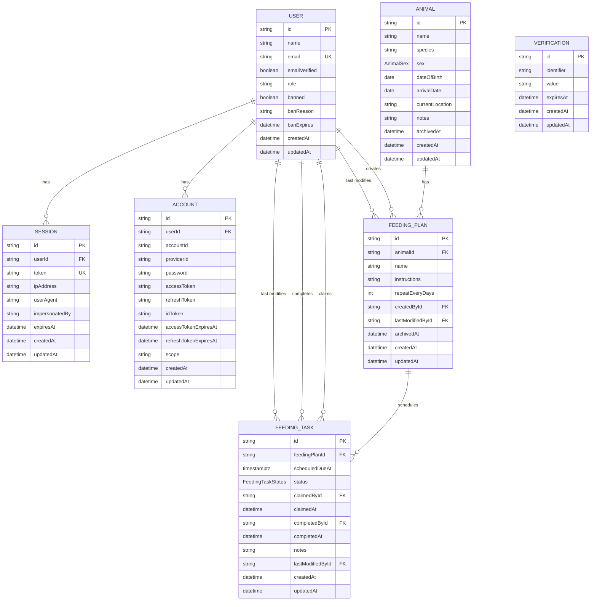

# Zootracker Entity Relationship Model

This document describes Zootracker's logical data model through Phase 9.
`backend/prisma/schema.prisma` remains the source of truth for the implemented
physical schema.

## Status

| Area | Status |
|---|---|
| Better Auth users, sessions, accounts, and verification | Implemented |
| Animals | Implemented |
| Feeding plans | Implemented |
| Immutable feeding plans and archived history | Approved Phase 5 amendment |
| Feeding tasks, claims, and completed history | Implemented |
| Timestamp-based feeding schedules | Implemented |
| Dashboard data | Derived read-only aggregation from existing tables |

## Model



`Verification` belongs to Better Auth but has no database foreign key to
`User`; it identifies the relevant authentication flow through its
`identifier` value.

## Domain invariants

- Feeding-plan definition fields are immutable after creation: animal, name,
  instructions, and recurrence.
- Changing a plan definition requires archiving the old plan and creating a new
  independent plan.
- A plan's first scheduled timestamp creates its first `AVAILABLE` feeding
  task.
- A task references the exact immutable plan and scheduled occurrence involved
  in the work.
- Each active feeding plan has exactly one non-completed task.
- Feeding tasks use the `AVAILABLE` and `COMPLETED` states.
- A task claim is advisory: `claimedById` and `claimedAt` identify who said
  they intend to do the work, but completion can still be recorded by another
  keeper or administrator.
- `scheduledDueAt` stores the exact due instant as PostgreSQL `timestamptz`.
- Duplicate scheduled timestamps for the same feeding plan are allowed.
- Completing a task and creating its next scheduled task happen atomically.
- Completed tasks form feeding history; no separate feeding-record model is
  required.
- Dashboard screens query existing animals, personnel, feeding plans, and
  feeding tasks; no dashboard-specific persistence model exists.
- Feeding plans, animals, and personnel referenced by task history are
  preserved rather than cascade-deleted.
- Authentication credentials and sessions remain owned by Better Auth.

## Lifecycle

```text
AVAILABLE ---------------------> COMPLETED
```

Creating a feeding plan creates its first available task. Completing a task
creates the next available task from the plan's recurrence.
