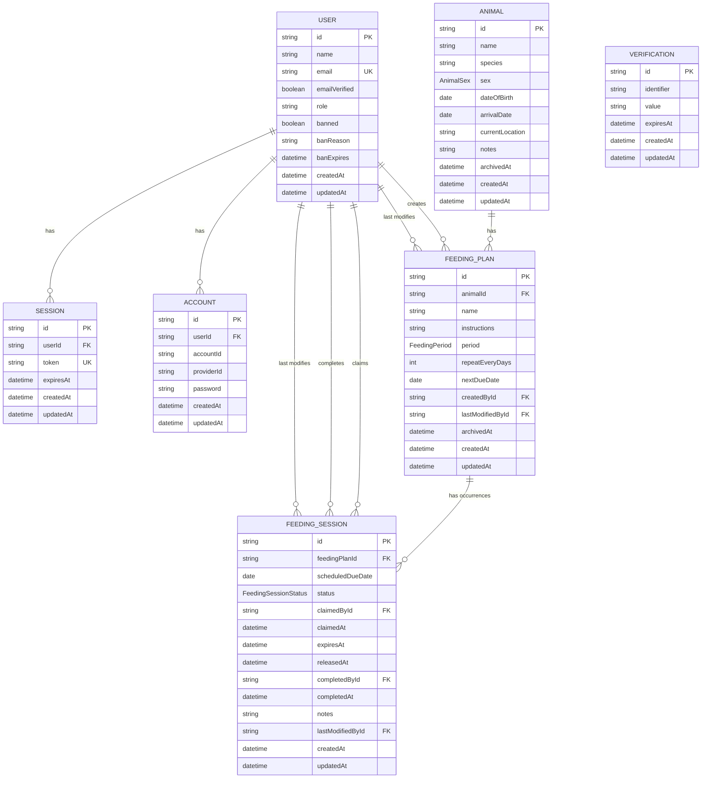

# Zootracker Entity Relationship Model

This document describes Zootracker's logical data model through Phase 7.
`backend/prisma/schema.prisma` remains the source of truth for the implemented
physical schema.

## Status

| Area | Status |
|---|---|
| Better Auth users, sessions, accounts, and verification | Implemented |
| Animals | Implemented |
| Feeding plans | Implemented |
| Immutable feeding plans and archived history | Approved Phase 5 amendment |
| Completed feeding sessions and history | Planned for Phase 6 |
| Feeding-session claim lifecycle | Planned for Phase 7 |

## Model



`Verification` belongs to Better Auth but has no database foreign key to
`User`; it identifies the relevant authentication flow through its
`identifier` value.

## Domain invariants

- Feeding-plan definition fields are immutable after creation: animal, name,
  instructions, period, and recurrence.
- Changing a plan definition requires archiving the old plan and creating a new
  independent plan.
- `FeedingPlan.nextDueDate` is mutable operational state, not immutable
  definition history. It advances through feeding completion and has no manual
  reschedule operation.
- A feeding session references the exact immutable plan and scheduled
  occurrence involved in the work.
- `FeedingSession.scheduledDueDate` preserves the occurrence after the plan
  advances to its next due date.
- Phase 6 may create a session directly in the completed state without a prior
  claim; its claim-related fields are nullable.
- Phase 7 may create multiple sessions for the same plan and scheduled date
  when earlier claims were released or expired, but only one may be effectively
  active and only one may be completed.
- The persisted session status is `CLAIMED`, `RELEASED`, or `COMPLETED`.
  `EXPIRED` is an effective API and domain status derived when a claimed
  session's `expiresAt` has passed.
- A claim is advisory. A keeper other than `claimedById` may complete the
  session after acknowledging the active claim; `completedById` records who
  actually completed it.
- Completing a session and advancing `FeedingPlan.nextDueDate` happen
  atomically.
- Feeding plans, animals, and personnel referenced by session history are
  preserved rather than cascade-deleted.
- Authentication credentials and sessions remain owned by Better Auth.

## Lifecycle

```text
direct completion:              COMPLETED
claim:                 CLAIMED -> RELEASED
                          |
                          +----> COMPLETED
                          |
                          +----> EXPIRED (derived from expiresAt)
```

A released or expired session remains available for operational review. A
later claim creates another session for the same scheduled occurrence. A
completed session is the feeding-history entry, so no separate feeding-record
or feeding-claim entity is required.
