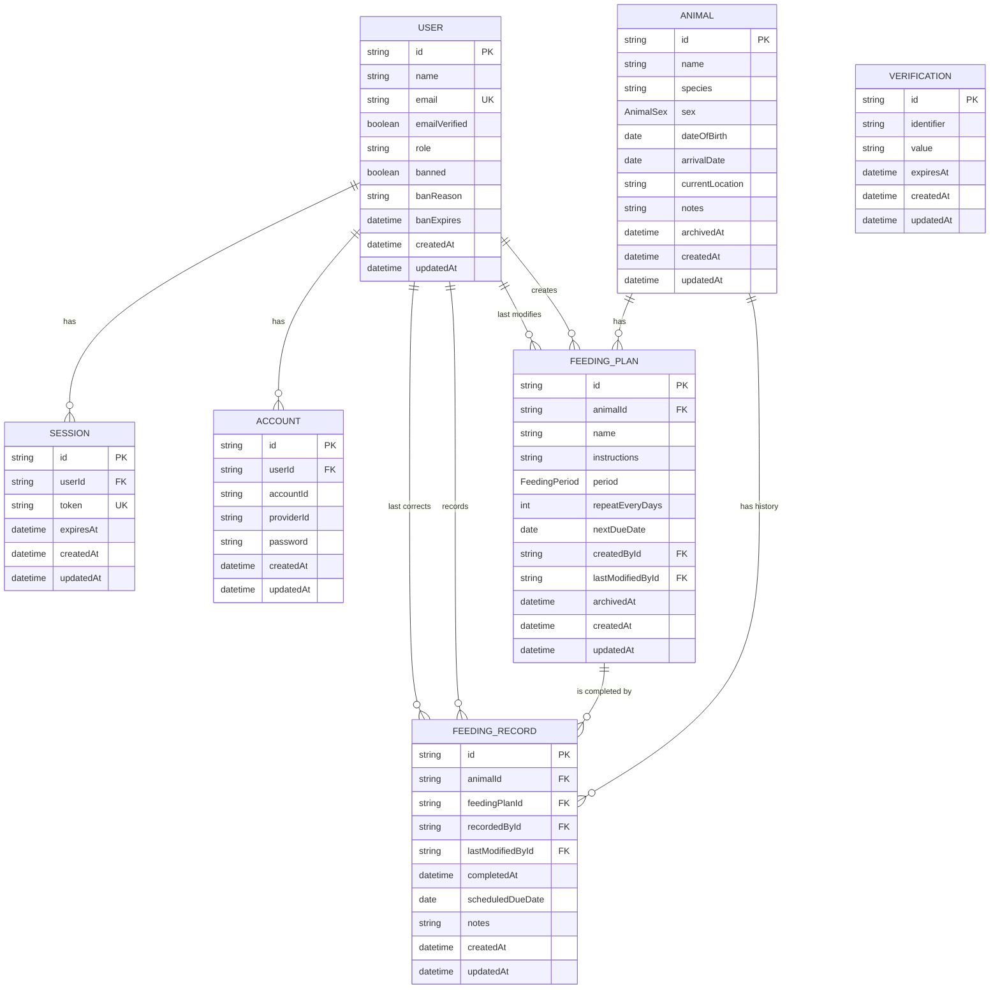

# Zootracker Entity Relationship Model

This document describes Zootracker's logical data model through Phase 6.
`backend/prisma/schema.prisma` remains the source of truth for the implemented
physical schema.

## Status

| Area | Status |
|---|---|
| Better Auth users, sessions, accounts, and verification | Implemented |
| Animals | Implemented |
| Feeding plans | Implemented |
| Immutable feeding plans and archived history | Approved Phase 5 amendment |
| Feeding records | Planned for Phase 6 |
| Feeding claims | Planned for Phase 7 and intentionally omitted |

## Model

`Verification` belongs to Better Auth but has no database foreign key to
`User`; it identifies the relevant authentication flow through its
`identifier` value.

## Domain invariants

- Feeding-plan definition fields are immutable after creation: animal, name,
  instructions, period, and recurrence.
- Changing a plan definition requires archiving the old plan and creating a new
  independent plan.
- `FeedingPlan.nextDueDate` is mutable operational state, not immutable
  definition history. It advances through feeding completion and has no manual
  reschedule operation.
- Feeding records reference the exact plan version that was completed.
- `FeedingRecord.scheduledDueDate` preserves the occurrence that was completed
  after the plan advances to its next due date.
- `feedingPlanId` plus `scheduledDueDate` uniquely identifies a completed
  scheduled occurrence.
- Feeding records, feeding plans, animals, and personnel referenced by history
  are preserved rather than permanently deleted.
- Authentication credentials and sessions remain owned by Better Auth.

## Phase 7 extension

Phase 7 will add `FeedingClaim` between a due feeding-plan occurrence and the
keeper attempting the work. Released or expired claims will not create feeding
records. A completed claim will link to the feeding record created by the same
atomic completion workflow.
